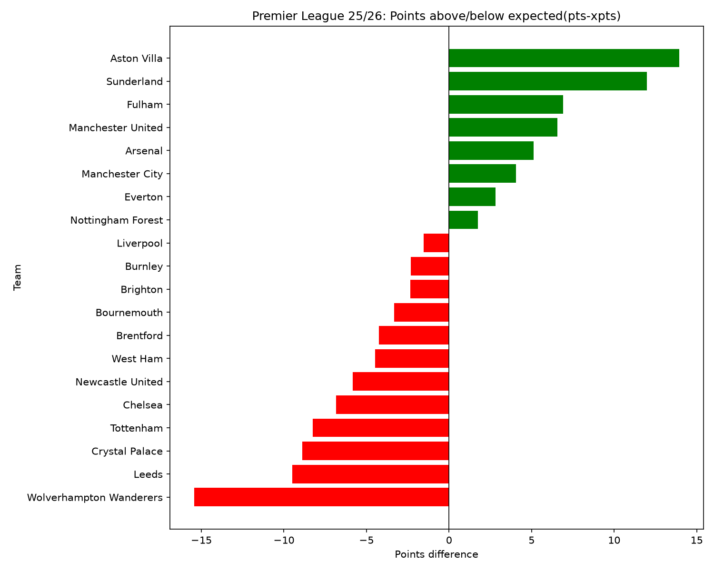
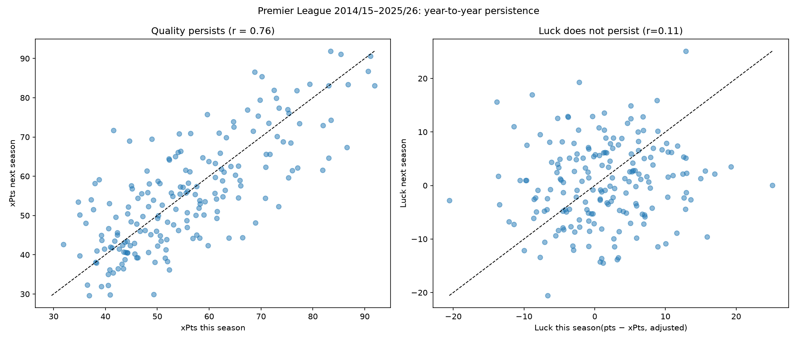
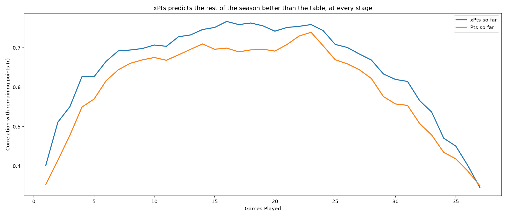

# Premier League: Luck or skill?

**Question:** 
Which PL teams are genuinely good and which are lucky? how early in the season can we tell?

In this project we explore whether a team's results reflect real quality or luck — and whether we can spot overperformers early enough to predict a drop.

Which teams are overperforming this season, and should we expect them to drop? 

**Data:** Understat (team match-level xG and expected points), via `jeke-understat-scrapper`.
## Progress
- **Session 1:** Pulled 2025/26 season data, compared actual points vs expected points (xPts).

**First finding:** Aston Villa earned ~14 points more than their chances justified and
finished 4th; based on xPts alone they'd have been 12th. Wolves were ~15 points below
expectation — but at 35 xPts they would still have been relegated.

Open question: is this luck or skill? Next step is to check whether over/underperformance
persists across seasons. Can we predict this season's lucky teams?

- **Session 2:**  Extended the data to 12 seasons (2014/15–2025/26, 240 team-seasons) and ranked every team-season by how far they over- or under-performed their expected points.

**Sanity Check**
Luck should roughly cancel out accross each season. In 2025/26 it summed to -20.
The reason: every draw removes 1 point from the league total (2 points for each team, leaving 1 out) 25-26 season had 104 draws versus 84 expected draws predicted by the model. To compare teams fairly, accross seasons, luck is adjusted by substracting each season's average ('luck_adj').

**5 Largest**
.png)
**5 Smallest**
.png)

**Findings** 
- **Liverpool 2019-2020**  is the biggest overperofmer of the decade. 99 points from 74 expected points (+25).
But 74 points would still have made them a great team. So they were good AND lucky.
Luck sits on top of quality; it doesn't replace it.
- **Aston Villa 2025/26** (+14) ranks 7th of the decade, and 2025/26 is the only season with two teams in the top 10 (Villa and Sunderland).
- **Manchester United** appears twice in the top 10 (2017/18 and 2023/24), but six years apart with different managers and squads. Even though I'm a United fan, that's not evidence that overperformance persists.

**Model limitation:** xG measures the quality of chances, not the quality of the goalkeeper (David De Gea saving the Titanic!)
facing them. An elite goalkeeper season shows up here as "luck", even though it's skill.

**Next (Session 3):** Does luck in one season predict luck in the next? If it's mostly luck, the relationship should be close to zero.

- **Session 3:** Tested whether over/underperformance persists from one season to the next.

**Method:** For every team, each season was paired with the same team's *next* season
(a self-join on team and season + 1). This gives 187 pairs across 11 consecutive-season
transitions; relegated teams drop out because they have no next Premier League season.
I then measured the year-to-year correlation (Pearson r) of two things: quality (xPts)
and luck (points above xPts, adjusted per season).

**Findings:**

| Metric | Year-to-year r | p-value | Interpretation |
|---|---|---|---|
| Quality (xPts) | 0.76 | < 0.001 | Persists strongly |
| Luck (pts − xPts) | 0.11 | 0.14 | No significant persistence |

- Quality is stable: this season's xPts explain about 58% (r²) of the variation in next season's xPts.
- Luck mostly disappears: a team that is +15 points "lucky" one season is expected to be only
  about +1.5 the next. This is **regression to the mean**.
- Example: Liverpool 2019/20, the luckiest season of the decade (+25), had roughly neutral luck
  the following season.

**Caveat:** A p-value of 0.14 doesn't prove luck has *zero* persistence — it means there's no
significant evidence of it. If a skill component exists (e.g. elite finishing or goalkeeping),
it is small. Relegated teams are also excluded from the pairs, which could slightly bias the result.

**Conclusion so far:** When a team's points run well ahead of its xPts, the gap is mostly
luck — expect it to shrink.

**Next:** How early in a season can we tell? Using match-by-match data, check after how many
games xPts becomes a better predictor of final points than the actual table.

- **Session 4:** How early in a season can we tell?

**Method:** Ordered every team's matches within each season and computed running totals.
At each point of the season (after 1, 2, ... 37 games), I compared two predictors of the
points a team would earn in its *remaining* games: points so far (the table) and xPts so far.
Predicting remaining points — rather than final points — avoids giving the table an unfair
advantage, since final points already include points so far. This is a backtest: the
"future" is already known for past seasons, so each predictor can be scored against it.

**Findings:**
- At almost every stage of the season, xPts so far predicts remaining points better than
  the table does (e.g. after 10 games: r = 0.71 vs 0.68; after 19 games: r = 0.76 vs 0.70).
- The advantage appears from the very first games and holds until the final rounds.
- Both curves fall late in the season because the target itself gets noisier: predicting
  points from a handful of remaining games is mostly luck. In the last game, neither
  predictor does better than the other.

**Conclusion:** If you want to know how a team will do from here on, look at its xPts,
not its league position.